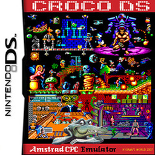
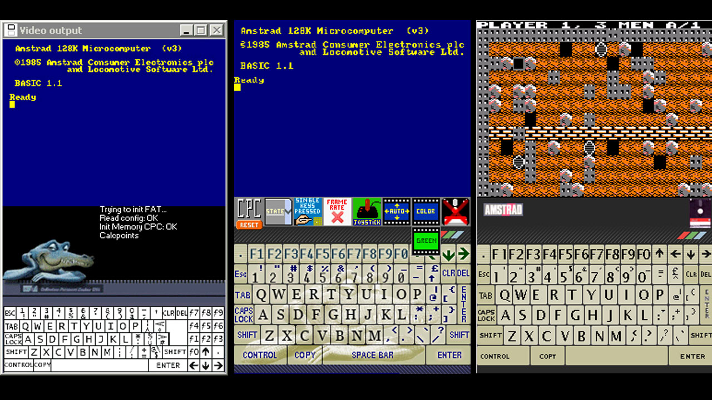

# Amstrad - CPC (CrocoDS)

### Description

CrocoDS is an Amstrad CPC 6128 emulator based on Win-CPC. It was originally created for the Nintendo DS.

### License

MIT

### Icon

### Fanart

Help make me fanart!

### Screenshots

